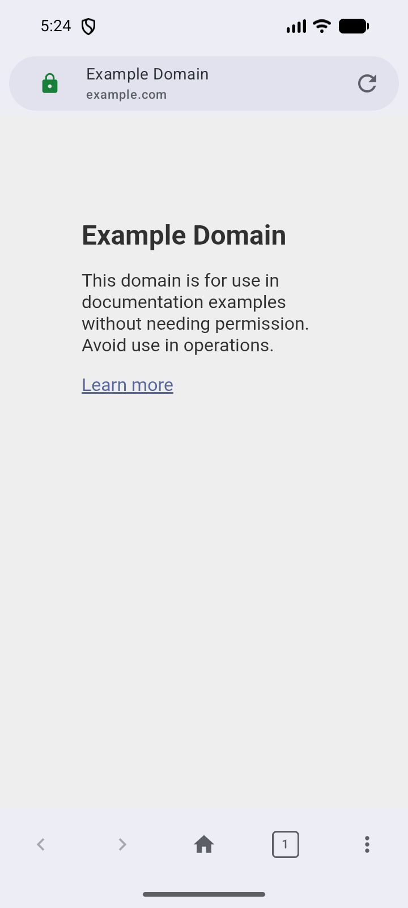
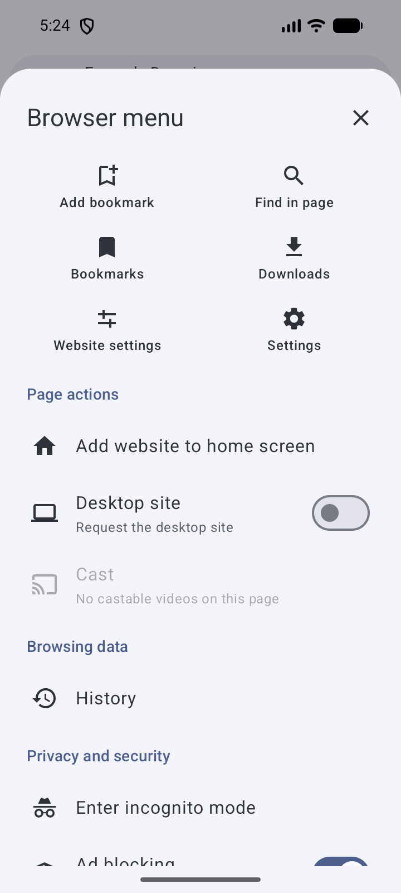
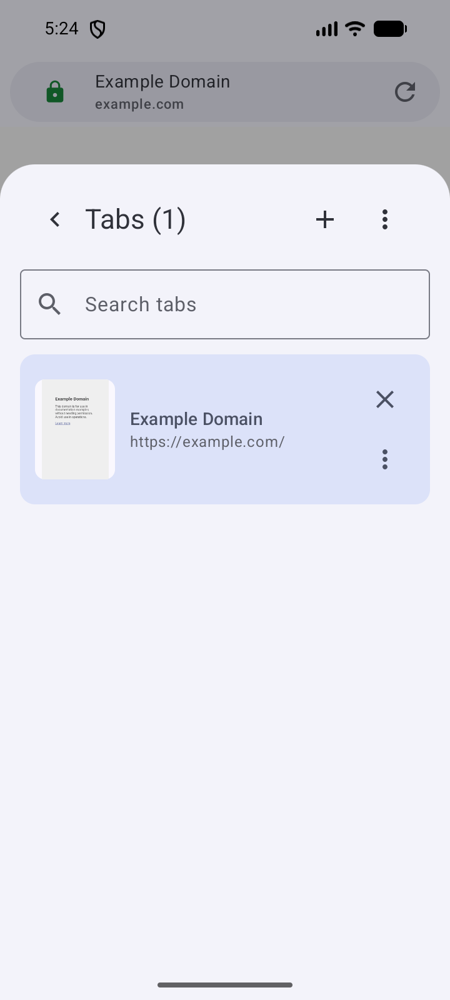
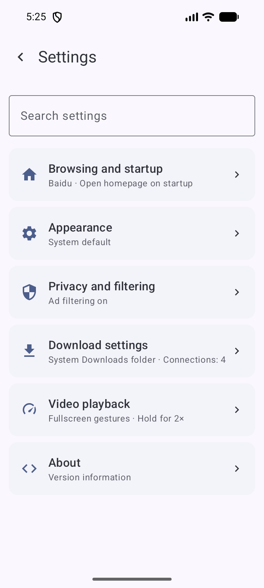
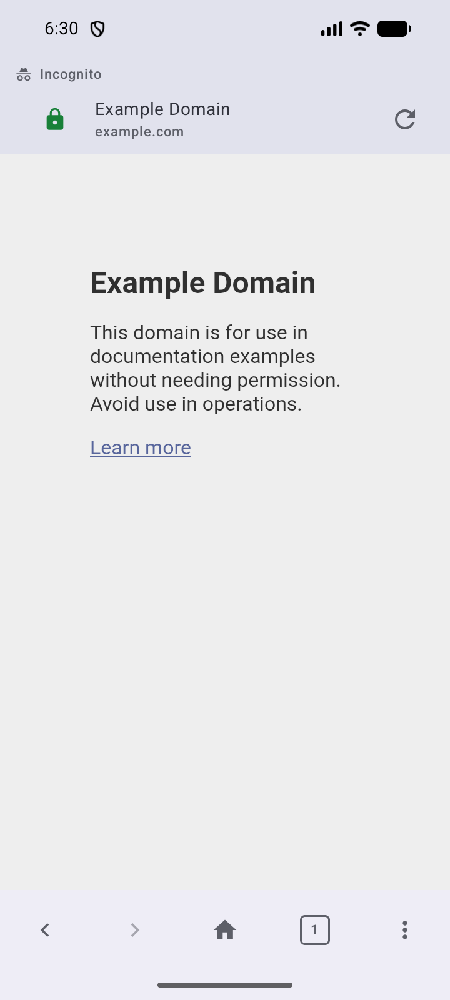

# Pure 浏览器

[中文](README.md) · [English](README.en.md)

[](https://github.com/Nobilta/pure-browser/actions/workflows/ci.yml)
[](https://github.com/Nobilta/pure-browser/releases/latest)
[](LICENSE)
[](#安装)

Pure 浏览器是一款开源的 Android 浏览器，基于系统 WebView，支持广告过滤、用户脚本、多标签浏览和视频播放。
界面采用 Material 3，支持深色模式与动态配色，无需 Google 服务。

**[下载最新版](https://github.com/Nobilta/pure-browser/releases/latest)** · [查看截图](#截图) · [反馈问题](https://github.com/Nobilta/pure-browser/issues)

支持 Android 10 及以上的 ARM64 设备（64 位 Android 系统）。

## 截图

| 浏览 | 菜单 | 标签 | 设置 | 无痕 |
|---|---|---|---|---|
|  |  |  |  |  |

## 主要功能

- **广告过滤与用户脚本**：内置广告过滤规则，可添加规则订阅和安装用户脚本。
- **标签与书签**：标签分组、搜索、页内查找，支持导入和导出书签。
- **视频播放**：全屏倍速播放、亮度与音量手势、画中画、后台播放，以及 DLNA 投屏。
- **下载管理**：暂停、继续和断点续传，支持选择保存目录。
- **离线扫码**：用相机扫描或从图片识别二维码，无需联网。
- **个性化界面**：自定义首页，地址栏可放在顶部或底部，支持简体中文、繁体中文和英文。
- **隐私管理**：无痕浏览、按网站管理权限、清理浏览记录与网站数据。

详细功能、网站兼容性和无痕模式的限制见[功能说明](FEATURES.md)。

## 安装

1. 在手机上打开[最新版本](https://github.com/Nobilta/pure-browser/releases/latest)，在 **Assets（附件）** 中下载 `PureBrowser-v<版本>-release.apk`。
2. 打开下载的 APK；如果系统提示，请允许当前下载来源安装应用。
3. 按系统提示完成安装。

升级时直接安装新版即可，保留原有书签和设置，**无需先卸载旧版**。
应用也会在启动时检查更新，你可以在「设置 → 关于」关闭自动检查，或手动检查更新。

每个版本的变化见[更新日志](CHANGELOG.md)。

## 从源码构建

项目使用 Kotlin、Jetpack Compose 和 Rust。构建支持 macOS、Linux 和 Windows，
Windows 请在 Git Bash 中运行脚本。请先按[贡献指南](CONTRIBUTING.md#开发环境)准备 JDK、
Android SDK/NDK、Rust、Node.js 和 Python。

```bash
git clone https://github.com/Nobilta/pure-browser.git
cd pure-browser
./build-and-test.sh --quick      # 运行自动检查
./gradlew :app:assembleDebug     # 构建可安装的调试版
```

调试版位于 `app/build/outputs/apk/debug/app-debug.apk`，可与正式版同时安装。
默认构建 ARM64；模拟器配置见[测试指南](TESTING_GUIDE.md)，签名与发版见[发布指南](RELEASING.md)。

想了解代码组织，可以从[架构说明](ARCHITECTURE.md)开始。

## 反馈与贡献

遇到问题或有功能建议，欢迎[提交 Issue](https://github.com/Nobilta/pure-browser/issues)。
描述问题时，请附上应用版本、Android 版本和复现步骤。安全漏洞请按[安全策略](SECURITY.md)私下报告。

欢迎通过 Pull Request 改进项目，开始前可以阅读[贡献指南](CONTRIBUTING.md)与[行为准则](CODE_OF_CONDUCT.md)。

## 许可

项目代码使用 [MIT 许可](LICENSE)。过滤规则和其他第三方组件的许可见[第三方说明](THIRD_PARTY_NOTICES.md)。
