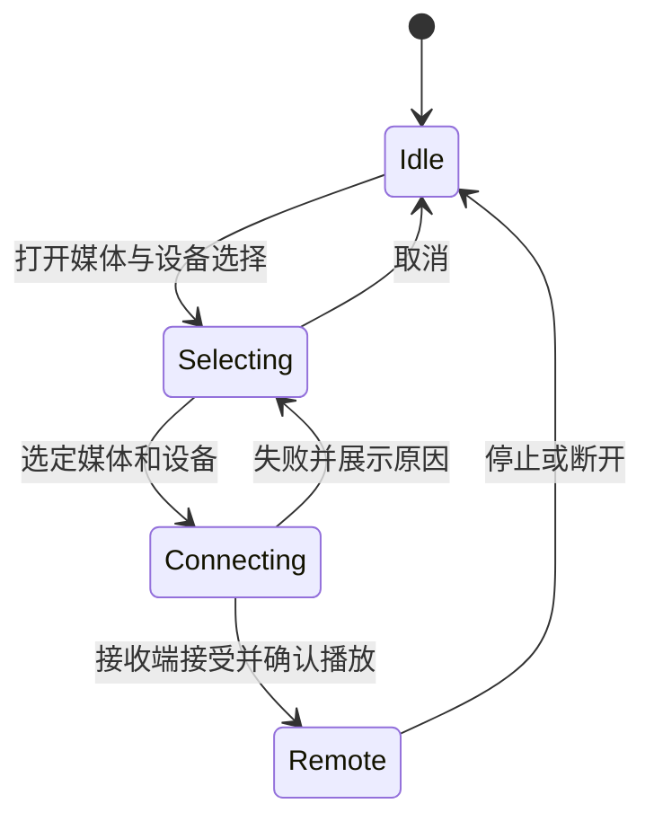

# 视频播放与投屏方案

2026-09-08。本文区分本次已落地的兼容性修正与后续投屏会话设计，实际可用能力以 README 为准。

## 现状与原因

Pure 的“自定义播放器”实际上是在 WebView 视频上叠加 Android 控件，解码仍由网页完成。
之前进入网页全屏后会自动尝试增强控件，注入脚本只修改 `video.controls`。
这只能隐藏 HTML 视频内置控件，无法隐藏 YouTube 等网站在视频外绘制的按钮、字幕菜单及广告层。
两层各自处理触摸和自动隐藏，因而有重复显示、操作冲突的条件；这不是两个独立解码器在播放。

投屏按钮原来取决于 `MediaCandidateStore.count > 0`。初始候选来自 `MediaSniffer` 对网络请求路径、
扩展名和 Accept 请求头的识别，并非验证过的电视可播放地址。YouTube 常使用 Blob/MSE、
音视频分离的分片和带签名的请求，通常不产生当前嗅探器认可的完整媒体候选。
Cookie、Referer、签名有效期以及接收设备的解码能力还可能使识别到的 HTTP 地址投送失败。
不能将“没有候选”直接解释成 DRM，也不能将“存在 HTTP 地址”解释成可投屏。

Pure 当前实现 SSDP/DLNA，不包含 Google Cast SDK。网站自己的 YouTube 投屏入口也依赖
浏览环境、设备发现和接收端支持，WebView 不等同于完整 Chrome 的投送环境。
把 DLNA 按钮放到播放器里只解决入口位置，不会让它自动支持 YouTube。

## 播放器控制权

| 场景 | 控件归属 | 浏览器行为 |
|---|---|---|
| 网页内播放 | 网页 | 不叠加悬浮倍速或投屏按钮，倍速与投屏从菜单进入 |
| YouTube、网站自定义容器全屏 | 网页 | 仅承载 Chromium 全屏画面，不叠加浏览器标题栏、播放栏或手势层 |
| 标准 `<video controls>` 自身全屏 | 可交接 | 按现有增强控件设置，在网页确认隐藏内置控件后启用增强播放栏 |
| 旧 WebView 无法访问的跨域播放器 | 网页 | 保留网页控件，通过网页退出按钮或系统返回退出 |

本次已落实上述策略。网页能力必须同时满足：视频自身全屏、有可交接的内置控件、非 YouTube
播放域名。MSE/Blob 与 UI 控制权独立：普通 Blob 视频仍可使用增强手势；网站容器全屏即使
播放普通 MP4，也不能仅通过 `video.controls` 接管。

进入增强模式时固定 frame/video ID，等待命令回执；切换目标、退出、失败时撤下浏览器
播放与手势层，再恢复网页内置控件。过期的回执不能重新启用已退出的原生层，旧视频的恢复
命令不能撤销另一个视频的接管。每秒播放遥测只更新进度，不重置控制栏自动隐藏计时。
接管期间使用元素标记和临时样式抑制 Chromium 强制显示的内置视频控件；样式只匹配目标视频，
退出时移除样式并恢复原标记，不全局隐藏网站按钮。
网站内容策略阻止临时样式时，交接失败并恢复网页控件。
兼容的标准视频可在全屏右上角切换网页/增强控件；复杂网站保持网站自己的清晰度、字幕等入口。

后续可将当前连接状态显式建模为 `WEB -> CONNECTING -> ENHANCED -> WEB`，并给每次交接
增加会话 token；状态模型不应将“投屏中”强行作为互斥的第四种本地播放器模式。

## 投屏入口与会话

本次已落实：移除网页右下角悬浮入口，保留菜单入口和增强播放器控制栏投屏图标。
控制栏点击直接弹出媒体/设备选择窗口，取消仍停留全屏。没有候选时，菜单给出
“未检测到此视频可直接投送的媒体地址”，不会臆测为受保护视频。
播放器窗口重新获得焦点时恢复沉浸全屏，避免旧系统在弹层关闭后用导航栏覆盖播放按钮。
回归中发现旧 WebView 的候选列表可能漏掉已经加载的标准 MP4，本次增加当前视频 `currentSrc`
兜底，使用同一识别规则补充候选并保留签名参数。Blob、尚未加载的 `src` 和页面其他资源的线索
不会通过此路径生成候选；当前增强控制栏仍只在存在候选时显示投屏图标。

建议下一步把投屏做成独立于播放器的会话：

后续增强控制栏保留固定位置的投屏图标，无可用来源时点击可查看原因，菜单提供同一入口。
YouTube 等网页控制模式不向网站播放器内注入按钮，继续通过浏览器菜单访问媒体状态。
网页全屏遮住浏览器菜单时，先退出网页全屏；网站自己的投送入口仍由网站维护。

会话行为：

1. 默认选中与当前视频匹配的媒体，多媒体页面仍允许明确选择；列表称为“候选媒体”，
   避免承诺每条都能播放。URL 保留完整签名参数，切页与过期结果不能污染新的会话。
2. 选择设备后显示连接进度，只有 AVTransport 成功才记录已连接设备；查询接收端状态
   区分命令被接受和实际开始播放。失败保留选择窗口和本地播放状态，显示可理解的失败原因。
3. 远端确认开始播放后，暂停刚才选中的本地视频，避免双重声音。用户取消、连接失败、
   切换本地视频时不误暂停其他媒体。停止投屏不强制自动播放本地内容。
4. 原生控制栏显示接收设备名称，并提供暂停/继续、音量和停止；菜单提供同一会话的控制入口。
   这些远端操作使用 DLNA 控制器，不再通过网页 bridge 操作本地视频。
5. 最初仅支持接收端可独立请求的完整媒体 URL。需要 Cookie、请求头转发或本地 Blob 的
   场景另行评估代理服务的范围、生命周期与鉴权；不自动导出网站凭据。

第 1 至 5 项为后续会话设计，当前版本仍是媒体/设备选择加 AVTransport 直投，未实现完整远端控制界面。

## YouTube 的处理

本轮使用网页播放器，并保留菜单倍速能力；不会重绘 YouTube 控件，也不会提取或拼凑其内部签名。
希望支持 YouTube 投送时，应优先使用 YouTube 自身支持的客户端/接收设备流程。
另行集成 Google Cast 需要兼容接收端和内容播放支持，单独引入 SDK 无法保证任意 YouTube 网页可投送。
系统屏幕镜像是另一个可选方向，需要 Android 的用户授权和设备协议支持，不属于现有 DLNA 直投。

## 验证

自动协议测试覆盖域名边界、自定义容器拒绝接管、标准/Blob 全屏交接、旧目标回执和恢复，
以及当前加载源与页面资源线索的区分；Android 测试覆盖候选遗漏后的恢复和完整签名保留。
模拟器回归通过真实触摸与页面遥测检查自动隐藏、切换控件、全屏投屏弹层、锁定返回和手势，
并用自定义网页播放器夹具验证网页独占控制。版本、安装包 hash 与实际结果见
[回归报告](../EMULATOR_TEST_REPORT.md)。真实 YouTube 在线页面和实体 DLNA 接收器需独立验证，
本地夹具与域名策略测试不等价于已经通过这两种环境。
