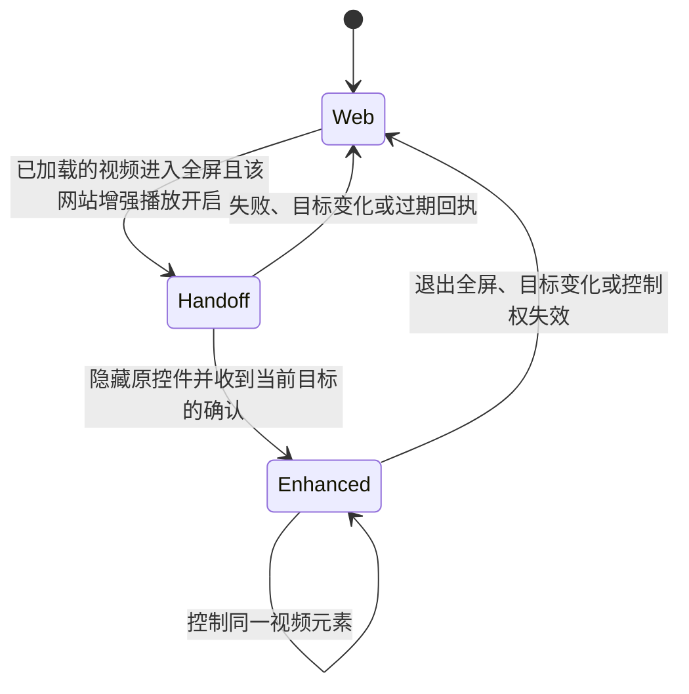
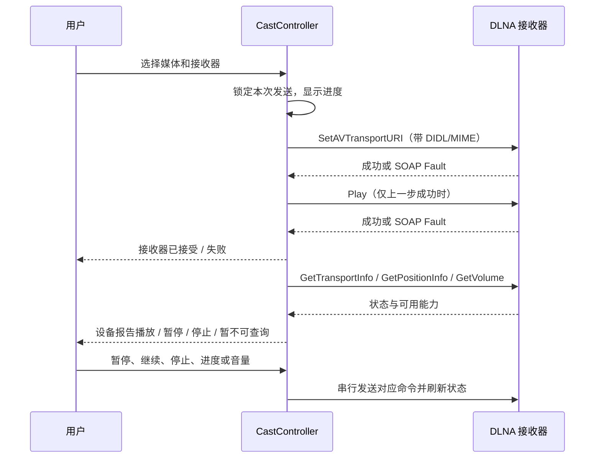

# 播放器与 DLNA 投屏

增强播放器控制网页中已经加载的视频，DLNA 则把媒体地址交给局域网接收器读取。
本文说明两条路径的控制权、状态和失败处理。使用方法见[功能介绍](../FEATURES.md#视频与投屏)，
检查方法和实测结果见[测试指南](../TESTING_GUIDE.md)及[回归报告](../EMULATOR_TEST_REPORT.md)。

## 控制权与回退

增强播放器沿用网页中已加载的 HTML 视频元素和 WebView 解码，仅尝试接管全屏控制界面。
是否接管取决于能否访问视频并隔离控件，网站自定义容器和域名本身不是排除条件。
直接 HTTP(S) 视频、无扩展名签名地址和 Blob/MSE 使用同一套交接流程，保留 Cookie、登录与媒体加载逻辑。

| 场景 | 控件与手势归属 |
|---|---|
| 非全屏视频、直播 | 始终保留原网页播放器与控件 |
| 已加载的视频自身或网站容器进入全屏 | 该网站增强播放开启时自动接管，无需 `controls` 属性 |
| 网站嵌套、自定义控件、动态追加控件 | 隐藏当前视频路径以外的控制层，使用浏览器控件及手势 |
| 无法访问的跨域播放器、交接失败 | 保留或恢复网页控件，系统返回仍可退出 |
| Blob/MSE 视频 | 控制原视频，不复制 Blob 地址、不新建播放器；地址本身不能用于 DLNA 直投 |

接管要求实际视频已有画面元数据，并能从该元素沿 DOM 路径定位播放器根节点。
网页侧保存 `controls` 与所有临时属性的原值；视频自身全屏时只隐藏 UA 控件，自定义容器全屏时还隐藏
路径上的兄弟分支和伪元素，并解除变换、裁剪等祖先布局限制，让原视频铺满全屏、按比例显示。
不会删除或移动视频、改写 `src`、重新调用 `load()`，也不会额外启动一份媒体播放。
网站之后追加的控件同样受限定样式约束；确认视频实际边界和控制层隐藏状态成功后，原生侧才启用触摸层。

网站 CSP 阻止样式、布局无法隔离、目标更换、超时或失败时回退。临时样式被删除或 DOM 路径失效时
恢复原控件，同一全屏会话不反复自动尝试，重新进入全屏后可再试。退出先撤下原生触摸层，再恢复网页标记和控件。
交接代次和 frame/video 身份阻止旧回执重新开启已退出的控件；暂停时固定当前目标，兄弟视频开始播放不会抢走控制。
网页自己的清晰度、弹幕、DOM 字幕等操作可在网站设置关闭增强全屏播放后使用；HTML 视频原生文本轨道仍由原视频处理。
没有标准视频元素、无法访问的 iframe 或无法隔离的布局仍需使用网站播放器，仅发现网络媒体地址不足以判断接管是否成功。

支持 `DOCUMENT_START_SCRIPT` 和 `WEB_MESSAGE_LISTENER` 的 WebView 逐 frame 探测并确认命令。
旧 Provider 仅操作主文档与可访问的同源 iframe，跨域播放器使用原控件；判断依据是 WebView 能力而非 Android 版本。
消息桥与文档开始注入分别检测：支持消息桥的旧 Provider 保留即时播放/暂停回传，脚本由加载后的探测注入。
这避免刚开始播放就切后台时，因等待周期探测而未及时应用后台播放偏好。

系统媒体状态使用独立的“可继续播放”标记。视频结束、隐藏并暂停、卸载、移除或切换页面后释放系统会话和通知；
释放时销毁旧 token，新待播元素不继承旧播放会话。消失 frame 的状态由 4 秒失效定时任务清理。
普通暂停仍支持系统继续播放；系统 Stop 或关闭 PiP 后，迟到的暂停快照不能重新建立会话。
PiP 复用原全屏视图，随 Activity content 容器缩放，使用稳定的进入前画面提示；关闭它优先于后台播放偏好。

## 网站开关与非全屏行为

网站设置的“增强全屏播放”按当前页面完整 origin 保存；尚无明确选择时继承全局“默认启用增强播放”。
明确的单站选择优先于全局默认值，保存并刷新后生效；重置该网站后重新继承默认值。
网站别名不会共享此选择；私密会话继承初始设置，但修改不会写回普通设置。

`MediaPlaybackTracker` 只注入 `playback-probe.js` 观察媒体并传递命令。
非全屏只观察播放状态，不注入控制层或修改网站控件。
全屏交接要求实际 `fullscreenElement` 或 WebKit 全屏状态，退出后恢复原控件，不再创建网页内增强层。
全屏工具栏没有模式切换与快退/快进按钮；双击两侧的 10 秒跳转手势保留。

## 手势与控件

- 单击显示/隐藏控件；双击中央播放/暂停，双击两侧快退/快进 10 秒。
- 左侧上下滑动调节当前窗口亮度，右侧调节媒体音量。
- 横向拖动预览时间，松手跳转；没有可跳转范围的直播禁用进度手势。
- 长按临时加速至用户选择的 2× 或 3×，不降低已有更快速度；松手、取消或切后台恢复原速度。
- 锁定后禁用手势，返回先解锁，再次返回退出全屏。
- 横向视频自动横屏，方形/竖向视频保持原方向；可以手动旋转，退出恢复原方向和窗口亮度。
- 操作以图标为主，手势反馈只显示速度、时间或音量/亮度数值；兼容性细节放在文档中。
- 控件在闲置 3.5 秒后隐藏，遥测更新不重新显示控件。打开投屏或倍速弹层时暂停隐藏计时，关闭后重新显示控件。

`FullscreenVideoView` 保留原解码视图与手势处理，`PlayerControls` 在同一窗口的 Compose 覆盖层绘制 Material 3 控件。
播放器固定使用深色主题，Android 12+ 采用深色动态配色；主播放按钮、tonal 操作按钮、滑块和计时字型使用配对的语义颜色。
控制条圆角 28dp，浮层圆角 24dp；按钮与进度触摸区域至少 48dp，控制条空白处和中央反馈提示不拦截原视频手势，连续长按/滑动无需等待提示消失。

倍速与投屏面板位于控制条上方并右对齐，宽度分别不超过 288dp/336dp，高度不超过 360dp 且受当前视口限制。
倍速提供七档紧凑单选网格，投屏复用候选/设备/远端控制内容，长列表只在面板内部滚动。
不创建 Dialog/PopupWindow，不走浏览器菜单路由，不改变系统栏状态；安全边距仅作用于控件覆盖层，原视频始终铺满宿主。
面板存在期间暂停隐藏计时，返回或首次外部点击只关闭面板；关闭后重启隐藏计时，后台/PiP/控制权失效时一并清理。
投屏面板按显示生命周期订阅和搜索，关闭后停止发现与状态轮询，已连接设备继续由原控制器管理。

## 媒体发现和当前视频

`MediaSniffer` 识别 HTTP(S) 请求路径、扩展名和 Accept 头中的媒体线索；
`MediaPlaybackTracker` 追踪实际视频元素；`MediaCandidateStore` 原子发布当前页面的有界候选快照。

视频已加载的 `currentSrc` 可补充网络监听遗漏的标准媒体地址。尚未加载的 `src`、网页资源列表、
Blob 和推测出的签名地址不会通过此补充路径直接成为候选。完整查询参数保留，避免破坏签名。

网页右下角有一个 56dp 投屏按钮，候选大于一个时显示数量；首页、编辑地址及新页面无候选时隐藏。
全屏视图遮盖页面层，增强播放器内使用控制栏入口；网站全屏不额外注入悬浮浏览器按钮。

选择页优先选中与当前实际播放视频匹配的候选，显示“正在播放”。精确 URL 匹配优先，随后使用
视频提供的有序来源线索；只标记能够与当前视频建立关联的来源。
候选后到、多个签名 URL、多个视频切换以及候选上限都保留当前匹配项。用户明确选中其他来源后尊重该选择。

## DLNA 发送

- SSDP 按设备 USN 或控制地址去重，离开选择页停止发现。
- 保留接收器声明的 AVTransport/RenderingControl 服务版本；SOAP URL 和标题正确转义。
- HLS、DASH、音频、视频提供对应媒体类型，未知格式使用通配值，不统一伪装为 MP4。
- 有界读取响应、拒绝 HTTP 重定向，连 HTTP 200 中的 SOAP Fault 也作为失败处理。
- 请求完成前禁用重复发送；销毁与取消通过请求代次丢弃迟到的结果。失败不会把待连接设备标为已连接。
- 初次接受只说明 SetURI 和 Play 成功；GetTransportInfo 返回 PLAYING 后才显示设备报告正在播放。
- 会话由 Application 的 CastController 持有，选择页可见时每三秒轮询，后台停止；没有新候选但已有会话时仍能进入控制页。
- 支持 Pause/Play/Stop、REL_TIME Seek 与 RenderingControl 音量。没有可靠总时长或音量服务时隐藏对应控件。
- 动作和轮询串行，忙时禁用重复播放/暂停；会话代次阻止旧响应覆盖新状态。控制失败明确提示，断开只解除本地控制关系。

当前能力包括 DLNA 直投与远端会话控制，没有 Google Cast、媒体转码或 Cookie/Referer 代理。
不会在请求仅被接受时自动暂停网页，避免接收器不支持该流而使两边都无法播放。
手机与设备须在同一局域网；媒体链接有效期、鉴权、音视频编码和设备能力仍影响结果。
本地 HTML 视频和远端会话的控制入口与状态独立。已有本地 SOAP 和状态机测试，尚未使用实体电视确认画面；设备报告 PLAYING 只说明其返回了播放状态。

## 网站兼容性

YouTube 常使用 MSE、分离音视频及短期签名请求。增强控件仍控制网站加载的原视频，不能绕过网站鉴权或解码限制；
没有候选只代表当前嗅探器没有可供直接投送的媒体地址，不等价于已判定 DRM。

JRS 等多来源直播页面使用相同策略：先由站点加载直播，再根据播放元素和请求关联当前候选；
能够确认控制权时使用增强层，无法确认时恢复网站触摸层。实际连通性、直播链接及截图按测试时间记录在回归报告中，
本地夹具不代替实体电视或在线站点验收。
